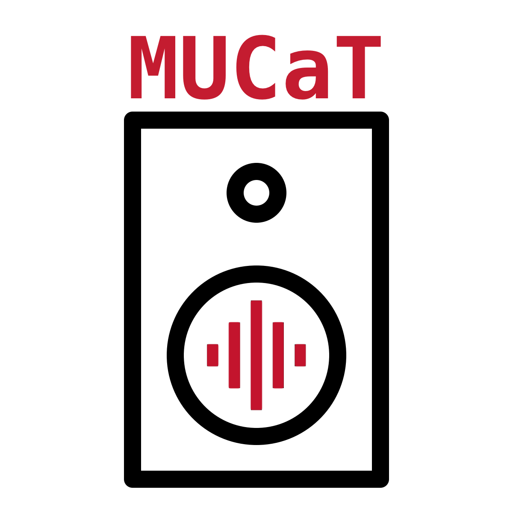
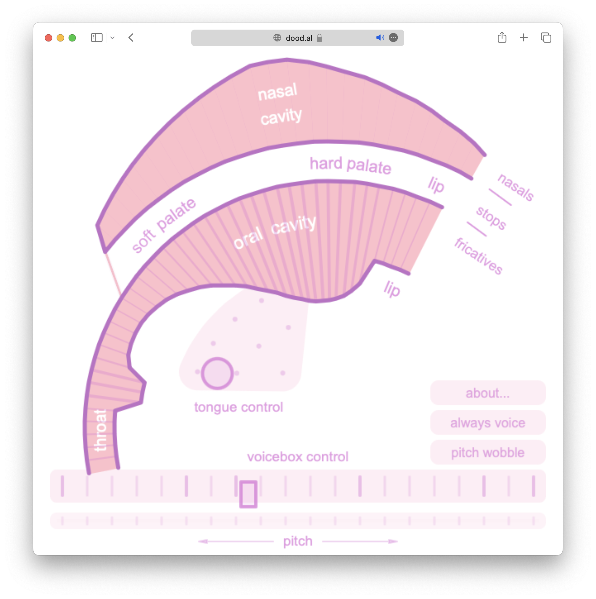

# Program Notes

  
  
Presented by Miami University Composition and Technology

---

## Dubious Toppings - Joo Won Park
A pizza-themed piece for piano and large electronic ensemble.

**Joo Won Park** ([joowonpark.net](https://joowonpark.net)) makes music with electronics, toys, and other sources that he can record or synthesize.   He is the recipient of Knight Arts Challenge Detroit (2019) and the Kresge Arts Fellowship (2020).  His music and writings are available on ICMC DVD, Spectrum Press, MIT Press, PARMA, Visceral Media, MCSD, SEAMUS, and No Remixes labels. He currently teaches Music Technology at Wayne State University.  

*Special thanks to Heather Merhout for playing piano with MULE on this concert.* 

---

## Gabberwonky - Ian Dilenschneider
*Gabberwonky* is a soundscape composition for the [Gibber](https://gibber.cc) coding language. Utilizing the collaborative "Gabber" feature, multiple ensemble members are able to live-code in the same environment and execute and run code together. The composition sweeps through rhythmic patterns as different samples are triggered at gradually ascending tempos until they fall into place together.

**Ian Dilenschneider** is a music technology major at Miami University.

---

## Dihydrogen Monoxide - MULE
1. Steam
2. Water
3. Ice

*Dihydrogen Monoxide* began with a prompt - find or record audio samples that abstractly represent the 3 phases of matter: gas, liquid, and solid. Using a custom digital instrument developed in Max to slice and loop sections of sound, the members of the ensemble explored the different textures, timbres, and internal rhythms of their various samples. The three movements of this piece were composed collaboratively, reflecting on the results after each rehearsal and gradually developing a score that gave structure to the performance while still allowing for individual interpretation and preference for different source materials.

---

## Ghost Ranger - Megan Haarlammert
Inspired by Megan’s affection for the spooky Halloween aesthetic, *Ghost Ranger* is a piece for assorted game controllers and MIDI devices that involves playing traditional music in a non-traditional way. Even though we are well into November, we hope you enjoy this spooky little tune with a touch of Wild West.

**Megan Haarlammert** is a sophomore music technology major and music composition minor from Cincinnati, Ohio. As a competitive ballroom dancer and gymnastics choreographer, as well as a music student, she enjoys writing music, playing music, and curating performances to music. Megan extends her gratitude to members of this ensemble and to the audience for the opportunity to present *Ghost Ranger*.

---

## Songs for Pink Trombone - MULE
1. Wub Wub
2. Omari
3. Incognito

[Pink Trombone](https://dood.al/pinktrombone/) is a model of the human vocal tract that synthesizes human voice from scratch, controllable with your fingers.  

"The 'QWOP' of speaking." - Digg  

  

While the Pink Trombone website is intended as more of an interactive educational experience than an instrument, *Songs for Pink Trombone* is MULE's execution of a common practice in music technology - exploring the musical affordances of "non-musical" devices and applications and repurposing them in a musical context.  

*Special thanks to Bennett Meacham for custom modifications to the Pink Trombone source code.*